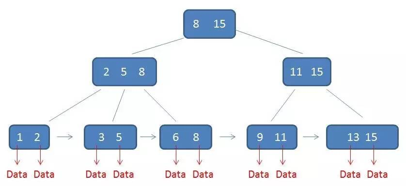

##### 背景知识 ---- B+树



```python
B+树的特征：
1.有k个子树的中间节点包含有k个元素（B树中是k-1个元素），每个元素不保存数据，只用来索引，所有数据都保存在叶子节点。
2.所有的叶子结点中包含了全部元素的信息，及指向含这些元素记录的指针，且叶子结点本身依关键字的大小自小而大顺序链接。
3.所有的中间节点元素都同时存在于子节点，在子节点元素中是最大（或最小）元素。

B+树的优势：
1.单一节点存储更多的元素，使得查询的IO次数更少。
2.所有查询都要查找到叶子节点，查询性能稳定。(因为data存储在叶子节点，非叶子节点只存储索引)
3.所有叶子节点形成有序链表，便于范围查询。
```


##### MySQL索引


##### 1. 说明

* 每个索引在 InnoDB 里面对应一棵 B+ 树

* 主键索引的叶子节点存的是整行数据（聚簇索引）
* 非主键索引的叶子节点内容是主键的值（二级索引）
* 回表：非主键索引查询到主键的值，再通过主键索引查找整行数据


##### 2. 维护索引有序性

* 如果新插入索引值处在现有索引值列表的中间，需要逻辑上挪动后面的数据，空出位置。

* 页分裂：如果新插入索引值导致数据页满了，此时需要申请一个新的数据页，然后挪动部分数据过去，这种情况除了影响性能，还会降低页的利用率

* 页合并：当相邻两个页由于删除了数据，利用率很低之后，会将数据页做合并


##### 3. 索引选择建议

* 从性能和存储空间方面考量，自增主键往往是更合理的选择。
* 自增主键本身有序，B+树维护索引有序性更方便

* 自增主键主键长度越小，普通索引的叶子节点就越小，普通索引占用的空间也就越小


