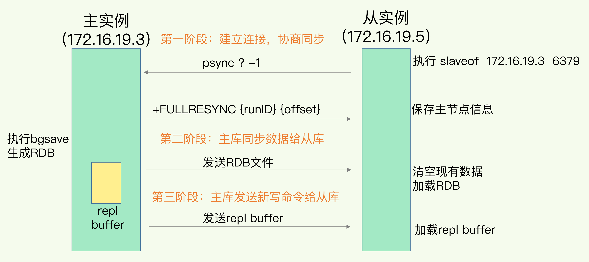

##### 主从配置

```rub
replicaof 172.16.19.3 6379
replicaof no one
```




* 主从库第一次同步的流程，fork子进程、生成rdb、传输rdb都会造成主库的压力，如果有多个从的话，可以采用“主-从-从”架构，将压力分散到从库上
* 首次连接完成后，后续的同步都是通过发送新增命令进行增量同步了（图中第三阶段）

* 当主从库断连后，主库会把断连期间收到的写操作命令，写入 replication buffer，同时也会把这些操作命令也写入 repl_backlog_buffer 缓冲区
* repl_backlog_buffer 是一个环形缓冲区，主库会记录自己写到的位置，从库则会记录自己已经读到的位置，如果主从断网后，主覆盖了从未读的位置，那么就走远了，需要重写配置主从关系（一切重来：fork子进程、生成rdb、传输rdb、、）类似 pg 的 wal_keep_segment参数

* **注：配置主从，从的数据会被覆盖，如有必要，配置前从最好做个全量备份RDB**

