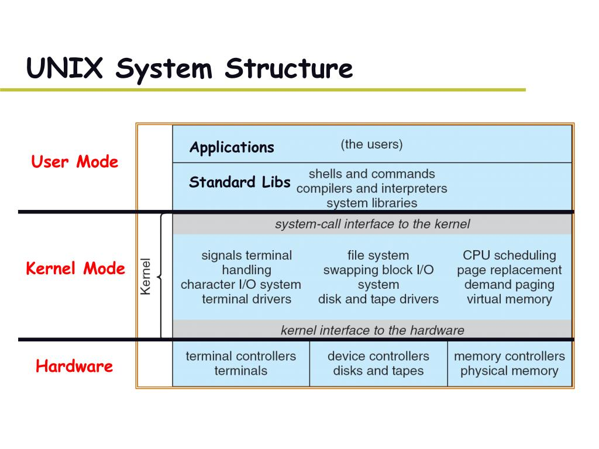

##### 特权级

```shell
* 在linux系统中特权级别分为0，1，2，3一共四个界别，0最大 ，3最小
* 一般内核代码运行在0特权级，驱动虚拟机等运行在1，2特权级，我们写的程序一般运行在3特权级
* 我们自己写的程序其实是个半成品，一些基本的操作：文件读写等，都是通过系统调用来实现的，这些是运行在0特权级别的内核代码，而我们自己的程序没权限直接访问磁盘等外设。我们自己的程序加上内核的程序代码才是一个完整的程序
```

##### 用户态、内核态

```shell
* 设置用户态、内核态+特权级，是为了控制权限，确保系统安全运行

* 用户态和内核态的转换
  1. 系统调用（用户态进程主动发起）
  2. 异常（如缺页异常、oom）
  3. 外围设备的中断（原先用户态，发生中断，切换至内核态，比如硬盘读写操作完成，系统会切换到硬盘读写的中断处理程序中执行后续操作等）
     当外围设备完成用户请求的操作后，会向CPU发出相应的中断信号，这时CPU会暂停执行下一条即将要执行的指令转而去执行与中断信号对应的处理程序
```

##### 中断

```shell
中断： 异步事件处理机制，可提高系统并发处理能力，为减少对正常进程运行调度的影响，中断处理程序就需要尽可能快地运行
硬中断： 直接处理硬件请求，快速执行（/proc/interrupts）
软中断： 由内核触发，延迟执行（/proc/softirqs）
事例： 网卡接收到数据包后，硬中断要把网卡的数据读到内存中，更新硬件寄存器状态，再发送一个软中断信号；
软中断则负责从内存中读取网络数据，再按网络协议栈，逐层解析处理数据，直到送至应用程序
```

##### inode、fd

```shell
Linux一切且文件，当进程打开或新建文件时，内核向进程返回一个文件描述符fd
（内核为了高效管理已被打开的文件所创建的索引，指向被打开的文件，所有执行I/O操作的系统调用都会通过文件描述符。

inode：储存文件元信息的区域，索引节点，每一个文件都有对应的inode，记录信息包括如下

$ stat .cron_file
  File: ‘.cron_file’
  Size: 297             Blocks: 8          IO Block: 4096   regular file
Device: fd09h/64777d    Inode: 17233945    Links: 1
Access: (0750/-rwxr-x---)  Uid: ( 6001/postgres)   Gid: ( 6001/postgres)
Access: 2021-01-13 15:01:19.464905383 +0800
Modify: 2021-01-13 15:01:19.450905242 +0800
Change: 2021-01-13 15:01:27.334987885 +0800
 Birth: -
 
$ df -i | grep -E "Inodes|home"  # 查看硬盘分区的inode总数和已经使用的数量
Filesystem                       Inodes    IUsed   IFree      IUse%  Mounted on
/dev/mapper/xxxx                 5240832   57      5240775    1%     /home

$ ll -i .cron_file  # 查看文件名对应的inode号码

$ touch lxp.txt
$ ln lxp.txt l1     # 硬链接：同一inode不同文件名，避免文件被误删
$ ln -s lxp.txt l2  # 软链接：符号连接，类似于Windows的快捷方式，指向被链接文件本身的位置信息
$ ll -i l*
8725724278133627 -rw-r--r-- 2 P 197121 0 3月  10 20:34 l1
2251799814023041 -rw-r--r-- 1 P 197121 0 3月  10 20:34 l2
8725724278133627 -rw-r--r-- 2 P 197121 0 3月  10 20:34 lxp.txt
```

##### 文本处理

```shell
ps -ef
ps -aux | head -1 && ps -aux | grep template | grep -v grep

nice <优先值-20到19> <进程名> - 通过给定的优先值启动一个程序
renice -n -p - 改变指定进程的优先值
renice -u -g - 通过指定用户和组来改变进程优先值

find   path   -option   [   -print ]   [ -exec   -ok   command ]   {} \;

find /tmp -mtime +28 -name "test*" -exec rm -rf {} \;
find ./ -maxdepth 1 -type f -name "test*"  -size +0 -perm 640 -atime +5 -exec  ls -l  {} \;
   -maxdepth： 0 表示当前目录也不搜索，即必定无输出
               1 表示仅搜索当前目录下的内容，即，当前目录的子目录不会被搜索
               如果不带该参数，会搜索当前目录+其下所有迭代子目录的内容
   -size：[+-] n   默认单位 块，1块=512字节/c，可选单位 k,m,g  
   -empty： 等于-size 0
   -type： d:目录， f:一般文件， l:符号连结 ，s:socket
           c:文件类型是c的文件， b: 区块装置文件， p: 具名贮列
   -atime [+-]时间: 按照文件访问时间搜索
   -mtime [+-]时间: 按照文件修改时间搜索
   -ctime [+-]时间: 按照文件修改时间搜索

awk '{print $1,$4}' test.txt                    # 每行按空格或TAB分割，输出文本中的1、4项     
awk '{printf "%-15s %-10s\n", $1,$4}' test.txt  # 格式化输出
awk -F : '{printf "%-15s %-10s\n", $1,$3}' test.txt    等同于   awk 'BEGIN{FS=":"} {printf "%-15s %-10s\n", $1,$3}' test.txt

sed -i "s#pacloud#paic#g" test.txt         # 换
sed -i "/date {/a\    `date`"  test.txt    # 加
sed -i "/2021/d"  test.txt                 # 删
sed '/^$/d' test.txt                       # 查阅非空行内容，如果加了-i，会删除test.txt的空行

grep -A 3 1234 test.txt      # 后3行
grep -B 3 1234 test.txt      # 前3行
grep -C 3 1234 test.txt      # 前后3行
grep -E "1|2" | grep -w 1 | grep -v 1.0  test.txt  # -E多选， -w精准匹配，-v反选

sort +  uniq 排序+统计次数 
cat test.txt | grep paic | cut -d : -f 1 | sort -n | uniq -c   #排序+统计次数 

wc -l test.txt  # 统计行数
wc -w test.txt  # 统计单词数，按空格或TAB分割

cat test.txt | tr a-z A-Z                                   # 小写替换为大写
cat test.txt | grep 112233 | tr -s 1,2,3    # 缩减连续重叠的1，2，3

fuser
  -m,--mount            show all processes using the named filesystems or block device


# 统计文本各单词个数
$ echo 'one two one one one five five one two' | tr ' ' '\n' | sort | uniq -c
      2 five
      5 one
      2 two
```

##### iptables & netfliter


```shell
iptables：用户态，只是Linux防火墙的管理工具，位于/sbin/iptables。
netfilter：内核态，真正实现防火墙功能，它是Linux内核中实现包过滤的内部结构

4表 & 5链：
1.filter表——三个链：INPUT、FORWARD、OUTPUT
作用：过滤数据包  内核模块：iptables_filter.

2.Nat表——三个链：PREROUTING、POSTROUTING、OUTPUT
作用：用于网络地址转换（IP、端口） 内核模块：iptable_nat

3.Mangle表——五个链：PREROUTING、POSTROUTING、INPUT、OUTPUT、FORWARD
作用：修改数据包的服务类型、TTL、并且可以配置路由实现QOS内核模块：iptable_mangle(别看这个表这么麻烦，咱们设置策略时几乎都不会用到它)

4.Raw表——两个链：OUTPUT、PREROUTING
作用：决定数据包是否被状态跟踪机制处理  内核模块：iptable_raw


iptables操作
iptables -t 表名 <-A/I/D/R> 规则链名 [规则号] <-i/o 网卡名> -p 协议名 <-s 源IP/源子网> --sport 源端口 <-d 目标IP/目标子网> --dport 目标端口 -j 动作

iptables -L -n --line-number
iptables -I INPUT -s 30.138.20.1,30.138.20.2,30.138.20.3 -p tcp --dport 2181 -j DROP
iptables -D INPUT 1
```

