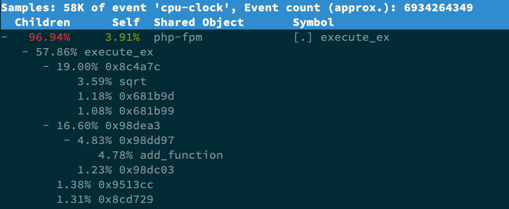

##### 1. 上下文切换

```python
内核：堆栈、寄存器、程序计数器
进程：虚拟内存、栈、全局变量
线程：共享进程虚拟内存，但有自己的私有数据、寄存器等不共享的数据

每个进程任务执行前都需要获取到cpu时间片，并且需要在cpu中暂存程序命令的信息，这个暂存的地方成为cpu上下文
CPU 上下文 = CPU 寄存器+ 程序计数器
	• 寄存器：是 CPU 内置的容量小、但速度极快的内存
	• 程序计数器：用来存储 CPU 正在执行的指令位置、或者即将执行的下一条指令位置

CPU 上下文切换，先把前一个任务的上下文保存至系统内核中，然后加载新任务的上下文到寄存器和程序计数器，跳转到程序计数器所指的新位置，运行新任务。

	• 系统调用发生的切换
	用户态进程通过系统调用进入内核态，寄存器里原用户态指令位置保存起来，接着更新为内核态指令的新位置，最后才跳转到内核态运行内核任务。而系统调用结束后恢复原来保存的用户态，然后再切换到用户空间，继续运行进程。
	所以，一次系统调用，发生了两次 CPU 上下文切换（系统调用过程通常称为特权模式切换，而不是上下文切换，这类切换是无法避免的）

    • 进程上下文切换
	*  进程是由内核来管理和调度的，进程的切换只能发生在内核态。
	*  进程的上下文不仅包括用户空间的虚拟内存、栈、全局变量等的资源，还包括了内核堆栈、寄存器等内核空间的状态。
	*  进程的上下文切换就比系统调用时多了一步：在保存当前进程的内核状态和 CPU 寄存器之前，需要先把该进程的虚拟内存、栈等保存下来；而加载了下一进程的内核态后，还需要刷新进程的虚拟内存和用户栈。
	*  保存上下文和恢复上下文的过程需要内核在 CPU 上运行才能完成。
	
    • 线程上下文切换
	* 前后两个线程属于不同进程：因资源不共享，所以切换过程就跟进程上下文切换是一样
	* 前后两个线程属同一个进程：因用户空间虚拟内存共享，所以切换时，虚拟内存这些资源就保持不动，只需切换线程的私有数据、寄存器等不共享的数据。
	* 因此，同进程内的线程切换，要比多进程间的切换消耗更少的资源，而这，也正是多线程代替多进程的一个优势。
	
    • 中断上下文切换
	* 为了快速响应硬件的事件，中断处理会打断进程的正常调度和执行，转而调用中断处理程序，响应设备事件。
	* 因为中断是内核态的，所以打断用户态的进程，无需保存进程的虚拟内存、全局变量等用户态资源。仅需要切换内核态中断服务程序执行所必需的状态，包括 CPU 寄存器、内核堆栈、硬件中断参数等。
	* 对同一个 CPU 来说，中断处理比进程拥有更高的优先级，所以中断上下文切换并不会与进程上下文切换同时发生。
	* 同样道理，由于中断会打断正常进程的调度和执行，所以大部分中断处理程序都短小精悍，以便尽可能快的执行结束

    综上，过多的上下文切换，会把 CPU 时间消耗在寄存器、内核栈以及虚拟内存等数据的保存和恢复上
    
    
$ vmstat 1   # 每隔1秒输出1组数据（需要Ctrl+C才结束）
procs -----------memory---------- ---swap-- -----io---- -system-- ------cpu-----
 r  b  swpd  free    buff   cache     si  so  bi  bo  in    cs      us sy  id wa st
 6  0  0     6487428 118240 1292772   0   0   0   0   9019  1398830 16 84  0  0  0
 8  0  0     6487428 118240 1292772   0   0   0   0   10191 1392312 16 84  0  0  0

r:   Running/Runnable,正在运行和等待 CPU 的进程数
b:  Blocked, 处于不可中断睡眠状态的进程数
cs: context switch，每秒上下文切换的次数
In: interrupt，每秒中断的次数
us: user，用户态cpu使用率
sy: system，系统内核态cpu使用率
    
    
$ pidstat -w 5     ----   每个进程上下文切换的情况
$ pidstat -wt 1    ----   -t, thread, 表示输出线程的上下文切换指标                             
08:14:05      UID   TGID       TID   cswch/s  nvcswch/s  Command
...
08:14:05      0     10551         -      6.00      0.00  sysbench
08:14:05      0         -     10551      6.00      0.00  |__sysbench
08:14:05      0         -     10552  18911.00 103740.00  |__sysbench
08:14:05      0         -     10553  18915.00 100955.00  |__sysbench
08:14:05      0         -     10554  18827.00 103954.00  |__sysbench
...
cswch : 每秒自愿上下文切换（voluntary context switches）次数，进程无法获取所需资源（ I/O、内存等系统资源不足时），导致的上下文切换。
nvcswch : 每秒非自愿上下文切换（non voluntary context switches）的次数，指进程由于时间片已到等原因（大量进程都在争抢 CPU 时），被系统强制调度，进而发生的上下文切换
```

##### 2. 中断

```shell
中断： 异步事件处理机制，可提高系统并发处理能力，为减少对正常进程运行调度的影响，中断处理程序就需要尽可能快地运行
硬中断： 直接处理硬件请求，快速执行（/proc/interrupts）
软中断： 由内核触发，延迟执行（/proc/softirqs）

软硬中断事例：
	• 网卡接收到数据包后，硬中断要把网卡的数据读到内存中，更新硬件寄存器状态，再发送一个软中断信号；
	• 软中断则负责从内存中读取网络数据，再按网络协议栈，逐层解析处理数据，直到送至应用程序

$ watch -d cat /proc/interrupts   # -d 参数表示高亮显示变化的区域
           CPU0       CPU1
...
RES:    2450431    5279697   Rescheduling interrupts       # 重调度中断（RES），表示唤醒空闲状态的 CPU 来调度新的任务运行, 中断升高还是因为过多任务的调度问题
```

##### 3. 进程状态

```shell
R：Running 、Runnable，表示进程在 CPU 的就绪队列中，正在运行或者正在等待运行
D：Disk Sleep，不可中断状态睡眠（Uninterruptible Sleep），一般表示进程正在跟硬件交互，并且交互过程不允许被其他进程或中断打断
S：Interruptible Sleep，可中断状态睡眠，表示进程因为等待某个事件而被系统挂起。当进程等待的事件发生时，它会被唤醒并进入 R 状态
Z：Zombie，僵尸进程，即进程实际已结束，但父进程还未回收它的资源（比如进程的描述符、PID 等）
I： Idle ，空闲状态，用在不可中断睡眠的内核线程上
T/t： Stopped 或 Traced，表示进程处于暂停或者跟踪状态
X： Dead，表示进程已消亡，top或ps命令中看不到

1. 不可中断进程增加，可能是系统或硬件发生了故障，导致出现了io性能问题
2. 正常子进程在结束后，会向父进程发送 SIGCHLD 信号，父进程会进行资源回收；如果子进程结束太快，父进程还没及时处理，子进程就会变成僵尸进程。
   通常，僵尸进程持续时间较短，在父进程回收资源后就会消亡；或父进程退出后，由 init 进程回收后也会消亡。
   一旦父进程没处理子进程的终止，且父进程一直保持运行状态，那么子进程就会一直处于僵尸状态。大量的僵尸进程会用尽 PID 进程号，导致新进程不能创建
```

##### CPU案例1

1 通过 top、ps、pidstat , 找出 CPU 使用率较高（比如100% ）的进程

```shell
$ top
...
%Cpu0  : 98.7 us,  1.3 sy,  0.0 ni,  0.0 id,  0.0 wa,  0.0 hi,  0.0 si,  0.0 st
%Cpu1  : 99.3 us,  0.7 sy,  0.0 ni,  0.0 id,  0.0 wa,  0.0 hi,  0.0 si,  0.0 st
...
  PID    USER   PR  NI    VIRT  RES     SHR  S  %CPU  %MEM    TIME+ COMMAND
21514 daemon    20   0  336696  16384   8712 R  41.9   0.2    0:06.00 php-fpm
21513 daemon    20   0  336696  13244   5572 R  40.2   0.2    0:06.08 php-fpm
21515 daemon    20   0  336696  16384   8712 R  40.2   0.2    0:05.67 php-fpm
21512 daemon    20   0  336696  13244   5572 R  39.9   0.2    0:05.87 php-fpm
21516 daemon    20   0  336696  16384   8712 R  35.9   0.2    0:05.61 php-fpm

```

2 定位应用内部函数

```shell
$ perf top -g -p 21515    # -g开启调用关系分析，-p指定php-fpm的进程号21515
以下，可以定位到 sqrt、add_function，接下来就需要分析对应的代码了
```



##### CPU案例2

```shell
如果cpu使用率较高，但通过top无法捕捉到对应的进程id，极可能出现了短时进程
	• 应用里直接调用了其他二进制程序，这些程序通常运行时间比较短，通过 top 等工具也不容易发现。
	• 应用本身在不停地崩溃重启，而启动过程的资源初始化，很可能会占用相当多的 CPU。

$ perf record -g   # 记录性能事件，等待大约15秒后按 Ctrl+C 退出
$ perf report      # 查看报告
$ execsnoop        # 专为短时进程设计的工具。通过 ftrace 实时监控进程的 exec() 行为，并输出短时进程的基本信息如 PID、父进程 PID、命令行参数以及执行的结果等
PCOMM       PID    PPID   RET ARGS
sh          30394  30393    0
stress      30396  30394    0 /usr/local/bin/stress -t 1 -d 1
sh          30398  30393    0
stress      30399  30398    0 /usr/local/bin/stress -t 1 -d 1
...
```

##### CPU案例3

1. ##### 现象

```shell
1. iowait 太高了，导致系统平均负载升高，并且已经达到了系统 CPU 的个数
2. 僵尸进程在不断增多，看起来是应用程序没有正确清理子进程的资源

$ top
top - 05:56:23 up 17 days, 16:45,  2 users,  load average: 2.00, 1.68, 1.39
Tasks: 247 total,   1 running,  79 sleeping,   0 stopped, 115 zombie
%Cpu0  :  0.0 us,  0.7 sy,  0.0 ni, 38.9 id, 60.5 wa,  0.0 hi,  0.0 si,  0.0 st
%Cpu1  :  0.0 us,  0.7 sy,  0.0 ni,  4.7 id, 94.6 wa,  0.0 hi,  0.0 si,  0.0 st
...
  PID USER      PR  NI    VIRT    RES    SHR S  %CPU %MEM     TIME+ COMMAND
 4340 root      20   0   44676   4048   3432 R   0.3  0.0   0:00.05 top
 4345 root      20   0   37280  33624    860 D   0.3  0.0   0:00.01 app
 4344 root      20   0   37280  33624    860 D   0.3  0.4   0:00.01 app
    1 root      20   0  160072   9416   6752 S   0.0  0.1   0:38.59 systemd
...
```

2. ##### iowait升高原因：

```shell
$ dstat 1 10    # 间隔1秒输出10组数据（可同时观察系统的 CPU、内存、磁盘 I/O、网络使用情况）
--total-cpu-usage-- -dsk/total-- -net/total- ---paging-- ---system--
usr sys idl wai stl | read  writ | recv  send|  in   out | int   csw
0   0   96   4   0  |1219k  408k |   0     0 |   0    0  |  42   885
0   0   2   98   0  |  34M    0  |198B  790B |   0    0  |  42   138

wai:98 + read:34M > 说明 iowait 的升高跟磁盘的读请求有关，很可能就是磁盘读导致的

从 top 的输出找到 D 状态进程的 PID
$ pidstat -d -p 4344 1 3  #-d展示 I/O 统计数据，-p 指定进程号，间隔 1 秒输出 3 组数据

指定进程无输出，可能是导致io问题的子进程已经执行结束，已经转变为了僵尸进程，也对应上面的僵尸进程增加的猜想

$ pidstat -d 1 20      # 间隔 1 秒输出20组数据
06:48:46      UID       PID  kB_rd/s   kB_wr/s  kB_ccwr/s  iodelay  Command
06:48:47        0      4615  0.00      0.00      0.00       1       kworker/u4:1
06:48:47        0      6080  32768.00  0.00      0.00       170     app
06:48:47        0      6081  32768.00  0.00      0.00       184     app


$ strace -p 6082      跟踪进程系统调用
strace: attach: ptrace(PTRACE_SEIZE, 6082): Operation not permitted
$ ps aux | grep 6082  僵尸进程，strace跟踪不到
root      6082  0.0  0.0      0     0 pts/0    Z+   13:43   0:00 [app] <defunct>

$ perf record -g
$ perf report

> app通过系统调用 sys_read() 读取数据, 从 new_sync_read 和 blkdev_direct_IO 能看出，进程正在对磁盘进行直接读，绕过了系统缓存，每个读请求都会从磁盘直接读，导致 iowait 升高

> open(disk, O_RDONLY|O_DIRECT|O_LARGEFILE, 0755)   # 删除 O_DIRECT 选项即可
```

3. ##### 僵尸进程

```shell
$ pstree -aps 3084    # -a ：输出命令行选项,  p：PID,  s：指定进程的父进程
systemd,1
  └─dockerd,15006 -H fd://
      └─docker-containe,15024 --config xxx
          └─docker-containe,3991 -namespace …
              └─app,4009
                  └─(app,3084)
                  
$ ps -ef | grep 4009
检查 4009进程/app 应用程序的代码，看下子进程结束的处理是否正确，比如有没有调用 wait() 或 waitpid() ，抑或是有没有注册 SIGCHLD 信号的处理函数

# 一个正确的使用案例
import os
if __name__ == "__main__":
   l = [i for i in range(10)]
    cid = os.fork()
    if cid ==0:
        print("this is children process")
    if cid > 0:
        os.waitpid(-1,0)
        print("this is parents process")
```

##### 4 结论

```shell
1. iowait升高问题，可能原因除了io性能外，还可以是程序进行了直接磁盘读写操作，绕过了系统缓存
2. 僵尸进程的产生，是父进程没有正确处理子进程的资源回收，如fork()子进程时，需要在正确位置调用wait()及时回收子进程资源
```

