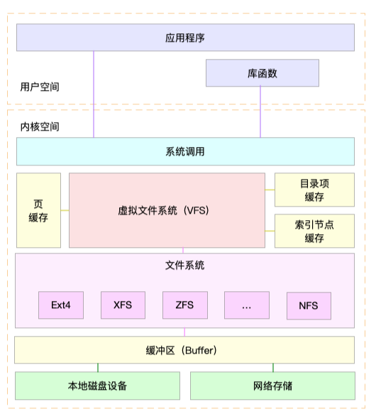

##### 1. 文件系统



```shell
磁盘：为系统提供了最基本的持久化存储
文件系统：在磁盘的基础上，提供了一个用来管理文件的树状结构

Linux文件系统工作原理
• 本身是对存储设备上的文件，进行组织管理的机制
• Linux 文件系统为每个文件都分配两个数据结构，索引节点（index node）和目录项（directory entry）
• 索引节点：记录文件元数据，如 inode 编号、文件大小、访问权限、修改日期、数据的位置等。会被持久化存储到磁盘中
目录项：记录文件名字、索引节点指针以及与其他目录项的关联关系。目录项由内核维护内存数据结构，叫做目录项缓存
```

##### 2. 文件系统 I/O

```shell
缓冲 I/O： 利用标准库缓存来加速文件的访问，而标准库内部再通过系统调度访问文件
非缓冲 I/O：直接通过系统调用来访问文件，不再经过标准库缓存

直接 I/O：跳过操作系统的页缓存，直接跟文件系统交互来访问文件
非直接 I/O ：文件读写时，先要经过系统的页缓存，然后再由内核或额外的系统调用，真正写入磁盘。

阻塞 I/O：应用程序执行 I/O 操作后，如果没有获得响应，就会阻塞当前线程，自然就不能执行其他任务
非阻塞 I/O：应用程序执行 I/O 操作后，不会阻塞当前的线程，可以继续执行其他的任务，随后再通过轮询或者事件通知的形式，获取调用的结果

同步 I/O：应用程序执行 I/O 操作后，要一直等到整个 I/O 完成后，才能获得 I/O 响应。
异步 I/O：应用程序执行 I/O 操作后，不用等待完成和完成后的响应，而是继续执行就可以。等到这次 I/O 完成后，响应会用事件通知的方式，告诉应用程序

$ df -h /dev/sda1     # 查看磁盘使用情况
$ df -i /dev/sda1     # 查看磁盘inode使用情况
```

##### 3. 查看系统io使用情况

```shell
$ iostat -d -x 1    # -d -x表示显示所有磁盘I/O的指标
Device r/s   w/s   rkB/s   wkB/s  rrqm/s  wrqm/s  %rrqm  %wrqm  r_await  w_await aqu-sz rareq-sz wareq-sz  svctm  %util 
loop0  0.00  0.00  0.00    0.00   0.00    0.00    0.00   0.00   0.00     0.00    0.00     0.00     0.00      0.00    0.00 

I/O 使用率：%util 
IOPS： r/s+ w/s 
吞吐量：rkB/s + wkB/s
响应时间： r_await + w_await 
```


4. 案例

```shell
$ top 
top - 14:43:43 up 1 day,  1:39,  2 users,  load average: 2.48, 1.09, 0.63 
Tasks: 130 total,   2 running,  74 sleeping,   0 stopped,   0 zombie 
%Cpu0  :  0.7 us,  6.0 sy,  0.0 ni,  0.7 id, 92.7 wa,  0.0 hi,  0.0 si,  0.0 st 
%Cpu1  :  0.0 us,  0.3 sy,  0.0 ni, 92.3 id,  7.3 wa,  0.0 hi,  0.0 si,  0.0 st 
KiB Mem :  8169308 total,   747684 free,   741336 used,  6680288 buff/cache 
KiB Swap:        0 total,        0 free,        0 used.  7113124 avail Mem 

  PID USER      PR  NI    VIRT    RES    SHR S  %CPU %MEM     TIME+ COMMAND 
18940 root      20   0  656108 355740   5236 R   6.3  4.4   0:12.56 python 
1312 root      20   0  236532  24116   9648 S   0.3  0.3   9:29.80 python3 

$ iostat -x -d 1    # -d表示显示I/O性能指标，-x表示显示扩展统计（即所有I/O指标） 
Device            r/s     w/s     rkB/s     wkB/s   rrqm/s wrqm/s  %rrqm  %wrqm r_await w_await aqu-sz rareq-sz wareq-sz  svctm  %util 
loop0            0.00    0.00      0.00      0.00     0.00     0.00       0.00     0.00      0.00      0.00        0.00      0.00     0.00          0.00   0.00 
sdb                0.00    0.00      0.00      0.00     0.00     0.00       0.00     0.00      0.00      0.00        0.00      0.00     0.00          0.00   0.00 
sda                0.00   64.00     0.00  32768.00 0.00    0.00       0.00     0.00      0.00     7270.44   1102.18 0.00   512.00      15.50  99.20

$ pidstat -d 1     # -d表示显示I/O性能指标
15:08:35      UID       PID         kB_rd/s   kB_wr/s   kB_ccwr/s iodelay  Command 
15:08:36        0        18940      0.00       45816.00   0.00           96           python 
• UID:  用户 ID
• PID:  进程 ID
• kB_rd/s:  每秒读取数据大小 ，单位是 KB
• kB_wr/s:  每秒发出的写请求数据大小，单位是 KB
• kB_ccwr/s:  每秒取消的写请求数据大小，单位是 KB
• Iodelay:  块 I/O 延迟，包括等待同步块 I/O 和换入块 I/O 结束的时间，单位是时钟周期

$ strace -p 18940 
strace: Process 18940 attached 
...
mmap(NULL, 314576896, PROT_READ|PROT_WRITE, MAP_PRIVATE|MAP_ANONYMOUS, -1, 0) = 0x7f0f7aee9000 
mmap(NULL, 314576896, PROT_READ|PROT_WRITE, MAP_PRIVATE|MAP_ANONYMOUS, -1, 0) = 0x7f0f682e8000 
write(3, "2018-12-05 15:23:01,709 - __main"..., 314572844 
) = 314572844 
munmap(0x7f0f682e8000, 314576896)       = 0 
write(3, "\n", 1)                       = 1 
munmap(0x7f0f7aee9000, 314576896)       = 0 
close(3)                                = 0 
stat("/tmp/logtest.txt.1", {st_mode=S_IFREG|0644, st_size=943718535, ...}) = 0 

$ lsof -p 18940 
COMMAND PID USER   FD    TYPE DEVICE  SIZE/OFF    NODE NAME 
python  18940   root    cwd   DIR   0,50       4096        1549389 / 
python  18940   root    rtd     DIR   0,50       4096        1549389 / 
… 
python  18940   root    2u     CHR  136,0       0t0       3 /dev/pts/0 
python  18940   root    3w    REG   8,1 117944320   303 /tmp/logtest.txt 

碰到“狂打日志”场景，可以用top、iostat、pidstat、strace、lsof 定位狂打日志的进程，找出相应的日志文件，通过调整日志级别来解决问题
如果应用程序不能动态调整日志级别，可能还需要修改应用的配置，并重启应用让配置生效


Case2：strace命令查看不到进程调用write命令时，可用opensnoop查看，发现这个根源是大量读写临时文件
$ opensnoop       # 属于 bcc 软件包，可以动态跟踪内核中的 open 系统调用
12280  python      6   0 /tmp/9046db9e-fe25-11e8-b13f-0242ac110002/650.txt 
12280  python      6   0 /tmp/9046db9e-fe25-11e8-b13f-0242ac110002/651.txt 
12280  python      6   0 /tmp/9046db9e-fe25-11e8-b13f-0242ac110002/652.txt 

Case3：SQL查询慢可能是查询列没有索引或者查询没有选对索引（没选对可以用force_index()选项指定）
$ top
$ iostat -d -x 1
$ pidstat -d 1
$ strace -f -p 27458        #  -f展示对应线程的数据读取情况
$ lsof -p 28014
$ pstree -t -a -p 27458    #  -t表示显示线程，-a表示显示命令行参数
$ lsof -p 27458
mysql> show full processlist;
mysql> use test;
mysql> explain select * from products where productName='geektime';

Case4：
$ strace -f -T -tt -p 9085 # -f表示跟踪子进程和子线程，-T表示显示系统调用的时长，-tt表示显示跟踪时间
```

