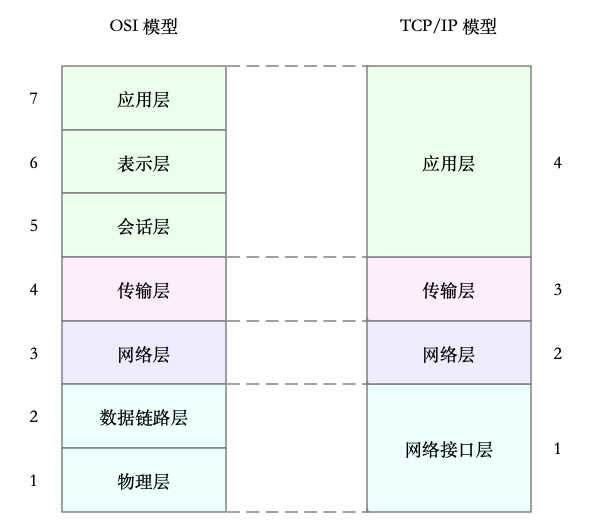

##### 1 网络

> 本质上是一种进程间通信方式

##### 2   OSI & TCP/IP模型

```shell
- 应用层，负责为应用程序提供统一的接口
- 表示层，负责把数据转换成兼容接收系统的格式
- 会话层，负责维护计算机之间的通信连接
- 传输层，负责为数据加上传输表头，形成数据包
- 网络层，负责数据的路由和转发
- 数据链路层，负责 MAC 寻址、错误侦测和改错
- 物理层，负责在物理网络中传输数据帧
```




##### 3 Linux网络模型：应用程序-----系统调用-----套接字-----tcp-----ip-----链路层-----网卡


```shell
- 网卡收发网络包的基本设备
- 在系统启动过程中，网卡通过内核中的网卡驱动程序注册到系统中。
- 网卡硬中断只处理最核心的网卡数据读取或发送，协议栈中的大部分逻辑，都会放到软中断中处理
```

##### 性能指标

```shell
性能指标：带宽、吞吐、pps、延迟等
网络吞吐和 PPS（sar -n DEV 1）  
$ sar -n DEV 1 #  -n DEV 表示显示网络收发的报告，数字1表示每隔1秒输出一组数据
13:21:40  IFACE   rxpck/s  txpck/s  rxkB/s   txkB/s  rxcmp/s  txcmp/s  rxmcst/s  %ifutil
13:21:41  eth0    18.00    20.00     5.79     4.25    0.00     0.00     0.00      0.00
13:21:41  docker0 0.00     0.00      0.00     0.00    0.00     0.00     0.00      0.00
13:21:41  lo      0.00     0.00      0.00     0.00    0.00     0.00     0.00      0.00
	
	• rxpck/s 和 txpck/s 分别是接收和发送的 PPS，单位为包 / 秒
	• rxkB/s 和 txkB/s 分别是接收和发送的吞吐量，单位是 KB/ 秒
	• rxcmp/s 和 txcmp/s 分别是接收和发送的压缩数据包数，单位是包 / 秒
	• %ifutil 是网络接口的使用率

连通性和延时（ping）
ping -c3   $target_host_ip
```

##### 查看socket状态

```shell
查看套接字状态（netstat / ss）
$ netstat -nlp | head -n 3  # -p:process，l:listened，n:num/显示数字地址和端口，t:tcp，u:udp   
Proto  Recv-Q  Send-Q  Local Address   Foreign Address    State       PID/Program name
tcp    0       0       127.0.0.53:53   0.0.0.0:*          LISTEN      840/systemd-resolve

$ ss -ltnp | head -n 3
State  Recv-Q Send-Q  Local Address:Port  Peer   Address:Port
LISTEN 0      128     127.0.0.53%         lo:53  0.0.0.0:*  users:(("systemd-resolve",pid=840,fd=13))
LISTEN 0      128     0.0.0.0:22     0.0.0.0:*        users:(("sshd",pid=1459,fd=3))

当套接字处于连接状态（Established）时
	• Recv-Q 表示套接字缓冲还没有被应用程序取走的字节数（即接收队列长度）
	• Send-Q 表示还没有被远端主机确认的字节数（即发送队列长度）
当套接字处于监听状态（Listening）时
	• Recv-Q 表示全连接队列的长度
	• Send-Q 表示全连接队列的最大长度

全连接：完成TCP三次握手后的连接，服务端会把这个连接挪到全连接队列中
半连接：还没有完成 TCP 三次握手的连接，连接只进行了一半
                 server收到client SYN 包后，会把这个连接放到半连接队列中，再向client发送 SYN+ACK 包（即，server收到SYN包则进入半连接）


```

##### DDOS ：distributed denial of service，分布式拒绝服务攻击

```shell
SYN Flood 攻击
发送大量SYN包，但不完成三次握手最后一次ACK，导致server端半连接队列堆积，从而无法新建连接

$ tcpdump -i eth0 -n tcp port 80
09:15:48.287047 IP 192.168.0.2.27095 > 192.168.0.30: Flags [S], seq 1288268370, win 512, length 0
09:15:48.287050 IP 192.168.0.2.27131 > 192.168.0.30: Flags [S], seq 2084255254, win 512, length 0
...
Flags [S] 表示这是一个 SYN 包。大量的 SYN 包表明，这是一个 SYN Flood 攻击

$ netstat -n -p | grep SYN_REC   # -n表示不解析名字，-p表示显示连接所属进程
tcp        0      0 192.168.0.30:80          192.168.0.2:12503      SYN_RECV    -
tcp        0      0 192.168.0.30:80          192.168.0.2:13502      SYN_RECV    -
...
$ netstat -n -p | grep SYN_REC | wc -l
193

解决：
1. 设置黑白名单 
$ iptables -I INPUT -s 192.168.0.2 -p tcp -j REJECT

2. 限制单个IP在60秒新建立的连接数为10
$ iptables -I INPUT -p tcp --dport 80 --syn -m recent --name SYN_FLOOD --update --seconds 60 --hitcount 10 -j REJECT

3. 调大连接表的大小
$ sysctl -w net.ipv4.tcp_max_syn_backlog=1024
net.ipv4.tcp_max_syn_backlog = 1024

4. TCP SYN Cookies 也是一种专门防御 SYN Flood 攻击的方法。
• SYN Cookies 基于连接信息（源地址、源端口、目的地址、目的端口等）及加密种子，计算 cookie
• 以该cookie作序列号，来应答 SYN+ACK 包，并释放连接状态
• 当客户端发送完三次握手的最后一次 ACK 后，服务器就会再次计算这个哈希值，确认是上次返回的 SYN+ACK 的返回包，才会进入 TCP 的连接状态。因而，开启 SYN Cookies 后，就不需要维护半开连接状态了，进而也就没有了半连接数的限制。
• 开启 TCP SYN Cookies：
$ sysctl -w net.ipv4.tcp_syncookies=1
net.ipv4.tcp_syncookies = 1
```

