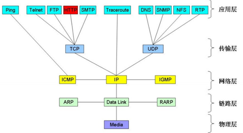

##### 1基础术语

```shell
- 网络：一组由网络协议地址联系在一起的主机
- 路由：网络路径的记录，管理数据包/报文的跨网络传输
- 通信：传输数据包/报文的过程(好比2个人之间的交流)
- 单播：成对主机间的通信
- 多播：一台主机可能跨越多个网络同时传播信息给多个目标
- 接口 interface：如Linux主机上执行ip a看到的 eth0、lo等，操作系统层面的网络接口  <---->  物理网卡/端口 <===> 外部网络
- 协议栈：TCP/IP（如下图）、OSI模型（下图的应用层由上往下划分为 应用层、表示层、会话层）
```



```shell
主机上有ARP表+路由表，arp协议负责将ip地址与物理地址进行转换

交换机：局域网内连接不同机器
路由器：连接不同的网络
ARP表：局域网间通过物理地址通信，地址信息存在ARP表中（补发arp包：arping -I $interface -c 5 $vip） 
路由表：不同网络间通过ip地址通信，地址信息存在路由表中

硬墙：一般指具有网络包过滤功能的路由器
软墙：一般指主机上的iptables策略
```


