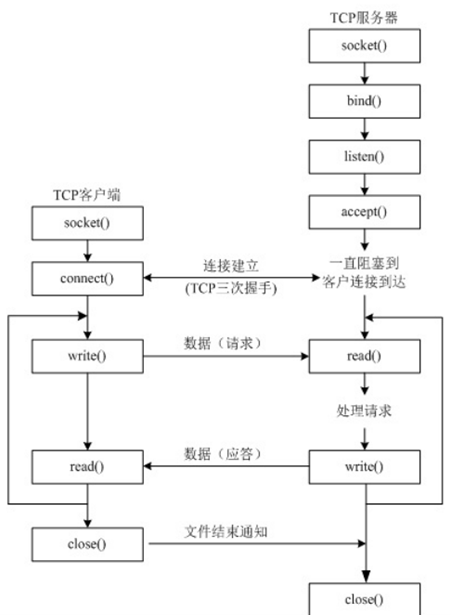
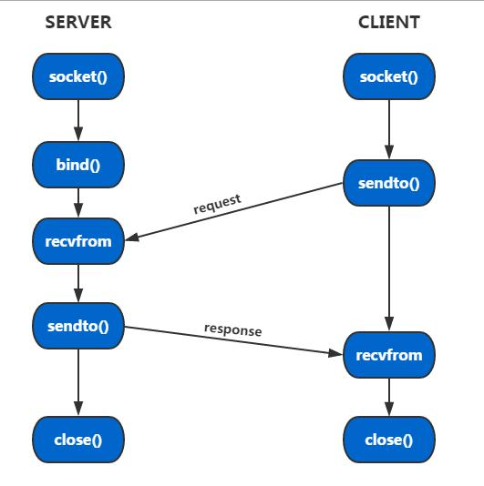

#### tcp：传输控制协议

```python
- 快速重传输
- 选择性确认（SACK & FACK）：允许接收方通知发送方已收到非连续的数据块，并期待发送方再次发送缺失的数据块，避免一个丢包导致整个发送窗口重新传输
- 三次握手建立连接前/SYN积压队列 + 建立连接后/侦听积压队列：2者分开，避免SYN洪水攻击影响到真实客户连接
- 发送与接收缓冲区：提供数据吞吐量
- 长连接策略/keepalive：复用已有连接，避免再次建立连接带来的开销
```





#### udp：用户数据报协议


#### tcp vs udp

```python
- tcp的connect利用三次握手建立连接，更可靠的传输数据。比如邮件等
- udp不属于连接型协议，因而具有资源消耗小，处理速度快的优点，所以通常音频、视频和普通数据在传送时使用UDP较多，比如直播
```

