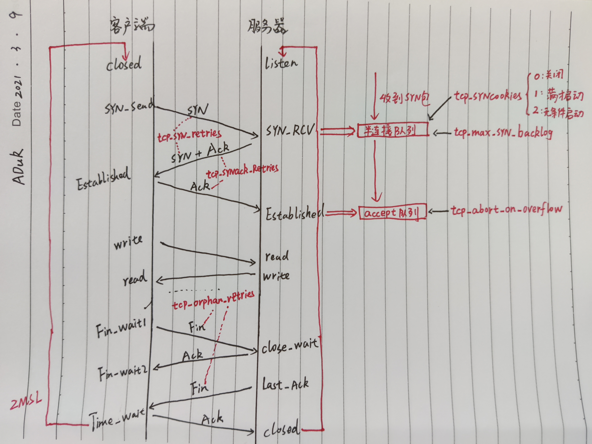

##### 前言

```python
TCP 不允许连接处于半打开状态时就单向传输数据，所以建立连接是三次握手；
TCP是允许连接处于半关闭状态单向传输数据的，所以断开连接可以有四次挥手

SYN：Synchronize Sequence Numbers，同步序列编号
FIN：Finish，发出FIN报文，表示不再发送任何数据
ACK：Acknowledge，确认包
```

##### 三次握手优化

```shell
三次握手优化：

/proc/sys/net/ipv4/tcp_synack_retries
/proc/sys/net/ipv4/tcp_syncookies           0/1/2
/proc/sys/net/ipv4/tcp_syn_retries               
/proc/sys/net/ipv4/tcp_max_syn_backlog      512
/proc/sys/net/ipv4/tcp_abort_on_overflow    0

/proc/sys/net/ipv4/tcp_fastopen             0/3
只有客户端和服务器同时支持时，TFO 功能才能使用，参数是按比特位控制的
01:客户端时支持 TFO
10:服务器时支持 TFO
11:完全支持 TFO 

客户端 SYN 报文会明确地告诉服务器它想使用 TFO 功能，这样服务器会把客户端 IP 地址用只有自己知道的密钥加密（比如 AES 加密算法），作为Cookie 携带在返回的 SYN+ACK 报文中，客户端收到后会将 Cookie 缓存在本地。之后，如果客户端再次向服务器建立连接，就可以在第一个 SYN 报文中携带请求数据，同时还要附带缓存的 Cookie
```



##### 四次挥手优化

```shell
断开连接方式：
1. 进程异常退出，内核就会发送 RST/Reset 报文来关闭。它可以不走四次挥手强行关闭连接，但当报文延迟或者重复传输时，这种方式会导致数据错乱，所以这是不得已而为之的关闭连接方案
2. 调close函数：会让连接变为孤儿连接（在半关闭状态下发送的数据到达主动方，进程也无法接收）
3. 调shutdown函数：允许在半关闭的连接上长时间传输数据
```

##### 1. 主动方优化

```shell
* 如FIN_WAIT1 状态连接有很多，降低 tcp_orphan_retries值，当重试次数达到 tcp_orphan_retries 时，连接就会直接关闭掉
$ cat /proc/sys/net/ipv4/tcp_orphan_retries 
0     # 默认值是 0，特指8次

* 孤儿连接：当进程调用 close 函数关闭连接后，无论连接是FIN_WAIT1状态，还是关闭了，都与该进程无关
* 为防止孤儿连接过多，导致系统资源长期被占用，如果孤儿连接数量大于tcp_max_orphans，新增的孤儿连接将不再走四次挥手，而是直接发送 RST 复位报文强制关闭
$ cat /proc/sys/net/ipv4/tcp_max_orphans    
32768 

控制孤儿连接 FIN_WAIT2 下连接的持续时长
$ cat /proc/sys/net/ipv4/tcp_fin_timeout
60 

控制 TIME_WAIT 连接数量，超过tcp_max_tw_buckets时，新关闭的连接就不再经历 TIME_WAIT 而直接关闭
$ cat /proc/sys/net/ipv4/tcp_max_tw_buckets
32768
```

##### 2. 被动方优化

```shell
内核没权替代进程去关闭连接，因为若主动方是通过 shutdown 关闭连接，那么它就是想在半关闭连接上接收数据。因此，Linux 并没有限制 CLOSE_WAIT 状态的持续时间。

当用 netstat 命令发现大量 CLOSE_WAIT 状态时,可能情况如下：
1. 程序Bug，read 函数返回 0 时忘记调用close 函数关闭连接
2. 程序负载太高，close 函数所在的回调函数被延迟执行了

CLOSING状态：双方同时发送FIN，内核回复 ACK 确认对方发送通道的关闭，仅一方的 FIN 报文对应的 ACK 还没有收到；系统会在适时重发 FIN 报文的情况下最终关闭
```

