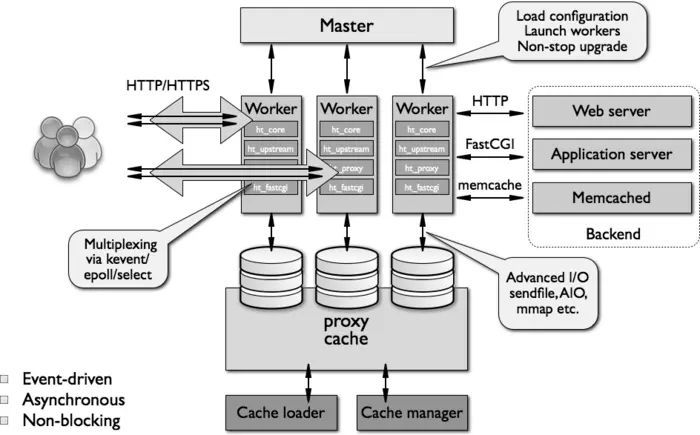

```shell
1.模型：
  多进程：充分发挥多核优势
  单线程：避免线程切换带来性能损耗
  io多路复用/边缘触发：解决单线程io操作的劣势
  
2.热部署：配置更新后，产生新的worker进程，以新配置处理新请求，老worker进程把旧请求处理完毕后会被kill掉
```

##### 配置

```shell
nginx最大最大连接数 = worker_processes * worker_connections
worker_processes 1;
events {
    worker_connections 100000;
    use epoll;
}

nginx四七层转发

cat nginx.conf 
worker_processes 1;

error_log  error.log;
pid        nginx.pid;

events {
    worker_connections 100000;
    use epoll;                         # Nginx的工作模式/io多路复用的方式
}
stream{
    log_format main '[$time_local] $remote_addr'
                    '$protocol $status $bytes_sent $bytes_received '
                    '$session_time "$upstream_addr" '
                    '"$upstream_bytes_sent" "$upstream_bytes_received"       "$upstream_connect_time"';
                  
    access_log xxx/logs/access.log main; 
    tcp_nodelay   on;
    upstream test {
            server 10.138.26.39:31223;
    }
    server{
        listen 127.0.0.1:3346;
        proxy_connect_timeout 10s;  # 配置与上游服务器连接超时时间，默认60s
        proxy_pass test;  
        proxy_timeout 2h;           # 配置与客户端上游服务器连接的两次成功读/写操作的超时时间，如果超时，将自动断开连接, 即连接存活时间，通过它可以释放不活跃的连接，默认10分钟
    }                                 
}

http {
  default_type application/octet-stream;

  log_format main '[$time_local] $remote_addr "$http_x_forwarded_for" $remote_port $remote_user '
                  '$host $upstream_addr $upstream_status $upstream_response_time $upstream_cache_status '
                  '"$request" $status $request_time $body_bytes_sent "$http_referer" "$http_user_agent" ';
  sendfile on;                # 开启高效文件传输模式
  tcp_nopush on;              # 防止网络阻塞
  tcp_nodelay on;             # 防止网络阻塞
  server_tokens off;
  keepalive_timeout 60;       # 设置客户端连接保持活动的超时时间。在超过这个时间之后，服务器会关闭该连接

  ssi on;
  ssi_silent_errors on;
  ssi_types text/shtml;

  server_names_hash_bucket_size 256;
  client_header_buffer_size 256k;          # 指定来自客户端请求头的headerbuffer大小
  large_client_header_buffers 4 256k;      # 指定客户端请求中较大的消息头的缓存最大数量和大小， “4”为个数，“256kK”为大小，最大缓存量为4个128K
  client_max_body_size 10g;                # 置允许客户端请求的最大的单个文件字节数
  gzip on;                                 # 开启GZIP压缩，实时压缩输出数据流
  gzip_disable "MSIE [1-6]\.(?!.*SV1)"; 
  gzip_min_length 1k;                      # 允许压缩的页面最小字节数
  gzip_buffers 4 16k;                      # 申请4个单位为16K的内存作为压缩结果流缓存
  gzip_http_version 1.1;                   # 设置识别HTTP协议版本，默认是1.1
  gzip_comp_level 2;  # 指定GZIP压缩比，1 压缩比最小，处理速度最快；9 压缩比最大，传输速度快，但处理最慢，也比较消耗cpu资源；
  gzip_types text/plain application/javascript text/css application/xml;  # 指定压缩的类型，无论是否指定，“text/html”类型总是会被压缩的
  gzip_vary on;      # 让前端的缓存服务器缓存经过GZIP压缩的页面，例如用Squid缓存经过Nginx压缩的数据
  upstream test1 {
          server 10.11.12.13:31784;        # 负载均衡方法包括 轮询/默认，Weight，ip_hash
       }
  server {
          listen      127.0.0.1:3922;
          access_log  xxx/access.log main;
          error_log    xxx/error.log;
          location / {
          proxy_set_header X-Forwarded-Host $host:$server_port;
          proxy_set_header Connection "";
          proxy_set_header X-Forwarded-Server $host:$server_port;
          proxy_set_header X-Forwarded-For $proxy_add_x_forwarded_for;
          proxy_set_header Host $host:$server_port;
          proxy_connect_timeout 90;
          proxy_send_timeout 90;
          proxy_read_timeout 90;
          proxy_buffer_size 256k;
          proxy_buffers 4 256k;
          proxy_busy_buffers_size 256k;
          proxy_temp_file_write_size 256k;
          proxy_max_temp_file_size 8m;
          proxy_pass  http://nginx_nxpl9vq7_1_extend;
          }
       }

}
```

