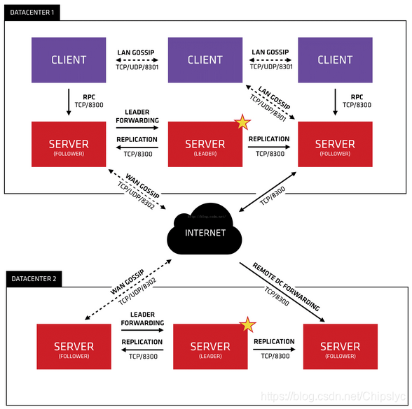

##### consul基本操作

```shell
consul operator raft list-peers （查看leader）
consul kv get -recurse | grep test
consul kv put test 123456 
consul members
```

##### 选主触发

```shell
若follower收不到leader发送的心跳包，它会触发选举，若投票数>1/2,选举成功，否则选举失败
# follower被动接收leader心跳包
```

##### 选主协议-Raft

```shell
投票三要素：term、log_index、只投一票，先来先得

初始时，集群内各成员term、log_index一致，只看谁获得大多数人的支持（根据"只投一票，先来先得"原则，首先发起投票的成员，极可能获得更多的票。生活亦是如此，先别人一步，才能有更大的胜算）

leader挂后，就看后天努力了，谁与leader同步信息更多，谁就会胜出（前两者一样的话就看谁先发起投票，谁先获得更多的投票）
```

> https://www.cnblogs.com/xybaby/p/10124083.html  

 


 