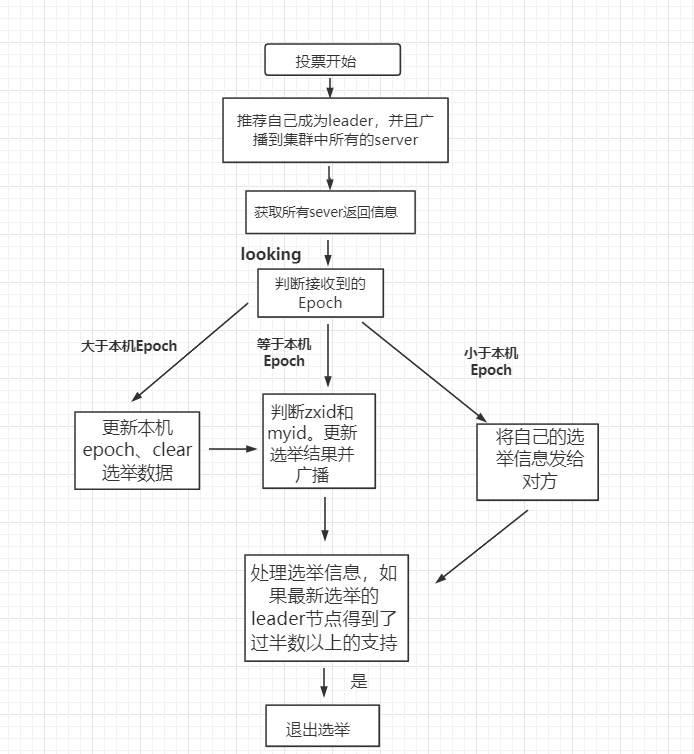

##### CAP 理论

* 一致性：在分布式环境中，一致性是指数据在多个副本之间是否能够保持一致的特性，等同于所有节点访问同一份最新的数据副本。在一致性的需求下，当一个系统在数据一致的状态下执行更新操作后，应该保证系统的数据仍然处于一致的状态。
* 可用性：每次请求都能获取到正确的响应，但是不保证获取的数据为最新数据。
* 分区容错性：分布式系统在遇到任何网络分区故障的时候，仍然需要能够保证对外提供满足一致性和可用性的服务，除非是整个网络环境都发生了故障。

```shell
一个分布式系统最多只能同时满足一致性（Consistency）、可用性（Availability）和分区容错性（Partition tolerance）这三项中的两项。

在这三个基本需求中，最多只能同时满足其中的两项，P 是必须的，zookeeper 保证的是 CP
```


##### 1 zk数据结构


##### 2 zk架构


##### 3 数据同步


##### 4 leader选举---ZAB协议

三种角色

```shell
Leader：接受所有Follower的提案请求并统一协调发起提案的投票，负责与所有的Follower进行内部的数据交换(同步);
Follower:直接为客户端服务并参与提案的投票，同时与Leader进行数据交换(同步);
Observer:服务客户端但不参与投票，同时也与Leader进行数据同步;observer的作用是为了拓展系统，提高读取速度。
```

四种状态

```shell
LOOKING（竞选状态，不知道leader是谁，正在搜寻）、LEADING、FOLLOWING、OBSERVING
```

四个阶段

```python
1.选举（Leader Election）
  以（sid，zxid）形式参与投票，先看zxid，大的为准leader，zxid相同的话，看sid，sid大的为leader（长子当家（验证通过））
2.发现阶段
  Followers 和上一轮选举出的准 Leader 进行通信，同步 Followers 最近接收的事务 Proposal主要目的是发现当前大多数节点接收的最新 Proposal，并且准 Leader 生成新的 epoch/阶段 ，让 Followers 接收，更新它们的 acceptedEpoch
3.同步阶段（Synchronization）
  同步阶段主要是利用 Leader 前一阶段获得的最新 Proposal 历史，同步集群中所有的副本。只有当 quorum（超过半数的节点） 都同步完成，准 Leader 才会成为真正的 Leader。Follower 只会接收 zxid 比自己 lastZxid 大的 Proposal
4.广播阶段（Broadcast）
  集群才能正式对外提供事务服务，Leader 可以进行消息广播。同时，如果有新的节点加入，还需要对新节点进行同步。Zab 提交事务并不像 2PC 一样需要全部 Follower 都 Ack，只需要得到 quorum（超过半数的节点）的Ack 就可以。
```

简化版

```
* 触发场景：
 （follower主动探测leader）若follower无法访问leader，它会触发选举，若投票数>1/2,选举成功，否则选举失败，若leader无法访问follower，不会触发选举
  
* 三要素：epoch时代、zxid事务id、sid（配置文件中定义的server_id）
* 起初：epoch、zxid大家都一样，只看serverid
* 后来：依次比较epoch、zxid、sid
```

