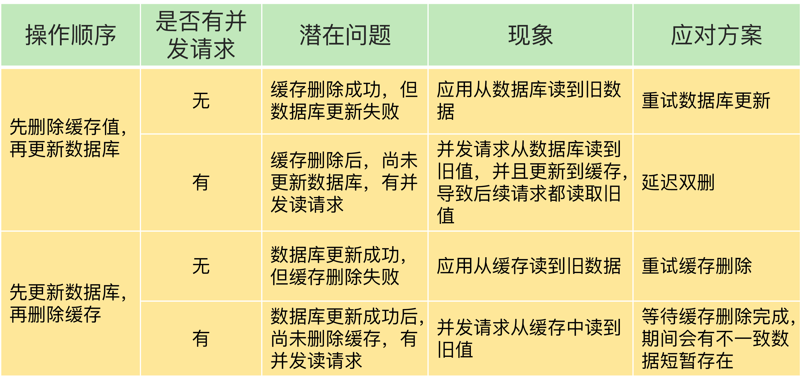

##### 1 内存淘汰策略

```Ruby
CONFIG SET maxmemory 4gb  # 设置最大缓存
1. 如果不设置数据淘汰策略，缓存满了，redis实例不在提供服务，直接放回报错
2. 设置淘汰策略，设置过期时间、随机删除、最近最少使用被删除等
```


##### 2 雪崩、击穿、穿透


##### 3 解决缓存与数据库一致问题（看取舍）




##### 4 大key：删除4.0有异步删除的


##### 5 热key的分析

问题：如促销活动，可能仅某个产品受欢迎，导致该产品频繁被访问，即负载都在一个节点上，其他节点负载小

* 热key不能拆分，可以选择进行架构修改为1主多从，将访问流量分散至从库

* 也可从应用侧修改，key名可以不一样，内容一致，通过应用控制（如hash等等）将流量分散至其他节点

